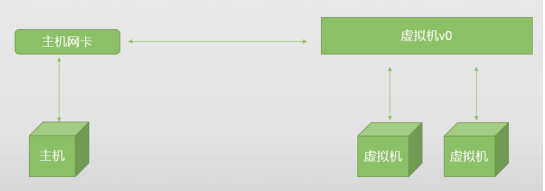

## <font color=gray>网络连接方式</font>

### <font color=darkgray>桥接模式</font>

通过桥接网络连接，虚拟机中的虚拟网络适配器可连接到主机系统中的物理网络适配器，在桥接模式下，虚拟机ip地址需要与物理主机在同一个网段，若需要联网，则网关与DNS需要与主机网卡一致。



修改静态ip地址：

```bash
vim /etc/sysconfig/network-scripts/ifcfg-ens33

TYPE="Ethernet"
PROXY_METHOD="none"
BROWSER_ONLY="no"
#修改默认的DHCP为none或者static，表示静态ip地址
BOOTPROTO="none"
DEFROUTE="yes"
IPV4_FAILURE_FATAL="no"
IPV6INIT="yes"
IPV6_AUTOCONF="yes"
IPV6_DEFROUTE="yes"
IPV6_FAILURE_FATAL="no"
IPV6_ADDR_GEN_MODE="stable-privacy"
NAME="ens33"
UUID="8bf8293e-cf76-4c03-a582-bbba8414a9c2"
DEVICE="ens33"
#设置启动就生效
ONBOOT="yes"

#静态ip地址的配置，参考物理主机的ip进行配置
#在cmd中输入ipconfig查看物理机IP
IPADDR=192.168.1.118
GATEWAY=192.168.1.1
NETMASK=255.255.255.0
DNS1=8.8.8.8
DNS2=114.114.114.114
```

### <font color=darkgray>nat网络模式</font>

使用NAT网络，虚拟机在外部网络中不必具有自己的ip地址。主机系统上会建立单独的专用网络，在默认配置中，虚拟机会在此网络中通过DHCP服务器获取地址，虚拟机和主机系统共享一个网络标识，此标识在外部网络中不可见。在NAT模式中，主机网卡直接与虚拟NAT设备相连，然后虚拟NAT设备与虚拟DHCP服务器，一起连接在虚拟交换机VMnet8上。

```bash
vim /etc/sysconfig/network-scripts/ifcfg-ens33

TYPE="Ethernet"
PROXY_METHOD="none"
BROWSER_ONLY="no"
#修改默认的DHCP为none或者static，表示静态ip地址
BOOTPROTO="none"
DEFROUTE="yes"
IPV4_FAILURE_FATAL="no"
IPV6INIT="yes"
IPV6_AUTOCONF="yes"
IPV6_DEFROUTE="yes"
IPV6_FAILURE_FATAL="no"
IPV6_ADDR_GEN_MODE="stable-privacy"
NAME="ens33"
UUID="8bf8293e-cf76-4c03-a582-bbba8414a9c2"
DEVICE="ens33"
#设置启动就生效
ONBOOT="yes"

#静态ip地址的配置，参考物理主机的ip进行配置
#根据在虚拟网络编辑器中nat模式的nat设备信息进行填写
IPADDR=192.168.175.125
GATEWAY=192.168.175.2
NETMASK=255.255.255.0
DNS1=8.8.8.8
DNS2=114.114.114.114
```


## <font color=gray>常用命令</font>

```bash
#查看当前环境设置的别名
alias
#设置临时别名
alias v33='vim /etc/sysconfig/network-scripts/ifcfg-ens33'
#设置永久别名
vim ~/.bashrc
alias v33='vim /etc/sysconfig/network-scripts/ifcfg-ens33'
```


```bash
#cat命令可以用于查看文件内容，或者利用重定向创建文件。
-n或--number：从1开始对所有输出的行数编号；
-b或--number-nonblank：对于空白行不编号；
-s或--squeeze-blank：当遇到有连续两行以上的空白行，合并为一行显示；
-A：行尾显示“$”；

cat -n /etc/fstab
cat > jfedu.txt << eof
cat >> jfedu.txt << eof
```


```bash
cp
#用来将一个或多个源文件或者目录复制到指定的目的文件或目录

语法：
cp [OPTION]... SOURCE DEST
option:
-a：此参数的效果和同时指定"-dpR"参数相同；
-d：可复制符号连接，不会破坏链接文件与源文件的链接关系。
-f：强行复制文件或目录，不论目标文件或目录是否已存在；
-i：覆盖既有文件之前先询问用户；
-l：对源文件建立硬连接，而非复制文件；
-p：保留源文件或目录的属性；
-R/r：递归处理，将指定目录下的所有文件与子目录一并处理；
-s：对源文件建立符号连接，而非复制文件（指定绝对路径）；
-u：使用这项参数后只会在源文件的更改时间较目标文件要新的时候或是目标文
件并不存在时，才复制文件；
-S：在备份文件时，用指定的后缀“SUFFIX”代替文件的默认后缀~；
-b：覆盖已存在的文件目标前将目标文件备份,后缀默认是~；
-v：详细显示命令执行的操作。

【-u】只复制源文件有更新的，否则不执行。
#第一次将lutixia.txt复制到data目录：
cp lutixia.txt /data/
#更新文件
echo "this is update" > lutixia.txt
#-u参数复制，提示是否覆盖，如果不想提示，可以使用\cp替换cp
cp -u lutixia.txt /data/

【-d|-a】复制软连接，这里要注意创建软连接时最好为绝对路径，否则可
能会出现失效的软连接。
ln -s /root/lutixia2.txt lutixia3.txt
# 如果直接复制，不带参数，会导致软连接失效，直接创建普通文件
# 加上参数：
cp -d lutixia3.txt /data/
【-S】复制同名文件到目的目录时，对源文件进行备份，且自定义备份文件
后缀名。
#第一次复制
cp lutixia2.txt /data/
#第二次复制，对源文件进行备份
\cp -S ". `date +%F`" lutixia2.txt /data/

【-a 】如果参数都记不住，就记住它吧，可以实现递归，复制软连接，保
留文件属性。
```


```bash
touch
#用户创建普通文件或者修改文件时间
touch file
-a 只修改访问时间（属性更改时间也会变）
-m 只更改修改时间（属性更改时间也会变）
stat file 查看文件的属性
```


```bash
mkdir
#创建目录
-p 自动创建上级目录，如果上级目录不存在；如果目录已经，则不创
建，不会提示报错。
mkdir -p /data/lutixia/lutixia
-m 可以指定创建目录时的权限。
mkdir -m 700 /data/lutixia2
```


```bash
less
#查看大文件，分屏显示，可以使用键盘翻屏
空格 显示下一屏内容
b 显示上一屏内容
f 显示下一屏内容
more
#可以实现分屏显示
空格 显示下一屏内容
b 显示上一屏内容
f 显示下两屏内容
```

